# 🌐 TurfGrid AI

**A highly-resilient, multi-agent platform for fan logistics, business readiness, and event operations during global sporting events.**

> Built for the [Google Cloud Rapid Agent Hackathon](https://devpost.com/) — MongoDB Track

[](LICENSE)
[](https://cloud.google.com/)
[](https://www.mongodb.com/)
[](https://ai.google.dev/)
[](https://groq.com/)

---

## 🎯 What is TurfGrid AI?

TurfGrid AI is an autonomous **multi-agent platform** that manages the complex logistics of large-scale sporting events. Instead of building for a single tournament, we built a **reusable agent architecture** that handles any sporting event — demonstrated with two real events happening simultaneously in 2026:

| Event | Dates | Location | Teams | Venues |
|-------|-------|----------|-------|--------|
| ⚽ **FIFA World Cup 2026** | June 11 – July 19 | USA, Mexico, Canada | 48 | 16 |
| 🏏 **ICC Women's T20 World Cup 2026** | June 12 – July 5 | England | 12 | 7 |

## 🔥 Key Hackathon Features

### 1. MongoDB Vector Search & Semantic Memory
Instead of relying on rigid keyword lookups, TurfGrid AI utilizes **MongoDB `$vectorSearch`**. Venue data is dynamically embedded into 768-dimensional vectors using Google's `models/embedding-001`. This allows users to ask natural language questions like *"Find me stadiums near water with large capacities"* and receive mathematically accurate results from Atlas!

### 2. High-Availability LLM Architecture (Gemini ➡️ Groq Failover)
Enterprise agents cannot afford downtime. TurfGrid AI implements a highly resilient architecture. It uses **Google Gemini 2.0 Flash** as its primary orchestrator. However, if the API quota is exhausted (`429 RESOURCE_EXHAUSTED`), the backend intercepts the failure and seamlessly fails over to **Groq's Llama-3.3-70b-versatile** model without dropping the user's session or breaking the UI. 

### 3. Real-Time API Agentic Tool Calling
Our agents are empowered with tools to fetch live data from the outside world:
- **Google Maps Distance Matrix API:** Agents calculate real-time driving durations and traffic delays from user locations to venues.
- **OpenWeatherMap API:** Agents fetch live atmospheric data to predict crowd congestion mitigation strategies.
- **Amadeus Travel API (Simulated):** Agents dynamically extract destinations using a custom NLP intent parser and generate highly realistic flight itineraries and hotel pricing.

### 4. Interactive Glassmorphism Dashboard
A stunning Next.js frontend featuring an intelligent Chat interface, interactive statistics, and a live Event Explorer. Clicking on any venue opens an interactive modal that pings our backend endpoints for real-time weather and traffic calculations!

---

## 🏗️ Project Architecture

```text
📦 TurfGrid-AI
 ├── 📂 backend/                 # FastAPI Backend Server
 │   ├── 📂 app/                 # Main Application Directory
 │   │   ├── 📂 agents/          # AI Orchestrator & Specialized Agents (Fan, Business, Crowd)
 │   │   ├── 📂 data/            # Seed Data & MongoDB Vector Search logic
 │   │   ├── 📂 tools/           # API Integrations (Weather, Maps, Amadeus)
 │   │   ├── 📄 config.py        # Environment & Configuration settings
 │   │   └── 📄 main.py          # Application Entry Point & API Routes
 │   ├── 📄 requirements.txt     # Python Dependencies
 │   ├── 📄 run_seed.py          # MongoDB Database Seeding Script
 │   └── 📄 run.py               # Uvicorn Development Server Runner
 │
 ├── 📂 frontend/                # Next.js React Frontend
 │   ├── 📂 src/
 │   │   ├── 📂 app/             # Next.js App Router structure
 │   │   │   ├── 📂 chat/        # LLM Agent Chat Interface
 │   │   │   ├── 📂 dashboard/   # Analytics & Insights Dashboard
 │   │   │   ├── 📂 events/      # Venue Explorer & Interactive Modals
 │   │   │   ├── 📄 globals.css  # Core styles, glassmorphism, animations
 │   │   │   ├── 📄 layout.js    # Root layout, Navbar, and Footer
 │   │   │   └── 📄 page.js      # Main Landing Page
 │   ├── 📄 package.json         # Node.js Dependencies
 │   └── 📄 next.config.mjs      # Next.js Configuration
 │
 ├── 📄 .env                     # Environment Variables (API Keys, DB URL)
 └── 📄 README.md                # Project Documentation
```

---

## 🔄 Project Workflow

```mermaid
graph TD
    %% User Interaction
    U[User Interaction<br/>Next.js UI] -->|Chat Query / UI Click| O
    
    %% Orchestrator & High Availability
    subgraph High Availability LLM Router
        O[TurfGrid Orchestrator]
        O -->|Primary: Success| G[Google Gemini 2.0 Flash]
        O -->|Primary: 429 Quota Exhausted| F[Failover Trigger]
        F -->|Fallback| L[Groq Llama-3.3-70b-versatile]
    end

    %% Specialized Agents
    G -->|Delegates| SA
    L -->|Delegates| SA

    subgraph Autonomous Agents
        SA{Specialized Agents}
        SA -->|Travel & Venues| FL[Fan Logistics Agent]
        SA -->|Demand & Checklists| BR[Business Readiness Agent]
        SA -->|Weather & Congestion| CI[Crowd Intelligence Agent]
        SA -->|Incidents & Staff| EO[Event Operations Agent]
    end

    %% External APIs & Tools
    FL -->|Simulated Data| T1((Amadeus Travel APIs))
    CI -->|Live Traffic| T2((Google Maps Distance Matrix))
    CI -->|Live Atmospheric| T3((OpenWeatherMap API))

    %% Database
    SA -->|Read/Write / Semantic Search| DB[(MongoDB Atlas<br/>w/ Vector Search)]
    
    %% Styling
    classDef primary fill:#4285F4,stroke:#fff,stroke-width:2px,color:#fff;
    classDef fallback fill:#F55036,stroke:#fff,stroke-width:2px,color:#fff;
    classDef db fill:#47A248,stroke:#fff,stroke-width:2px,color:#fff;
    classDef tool fill:#f59e0b,stroke:#fff,stroke-width:2px,color:#fff;
    
    class G primary;
    class L fallback;
    class DB db;
    class T1,T2,T3 tool;
```



## 🚀 Quick Start

### Prerequisites
- Python 3.11+
- Node.js 22.13+
- MongoDB Atlas account
- Google Gemini API key (Primary)
- Groq API key (Failover)
- Google Maps & OpenWeatherMap keys (Optional for Live Data)

### 1. Clone & Configure

```bash
git clone https://github.com/ayus1234/scheme-connect.git
cd scheme-connect
# Update .env with your specific API Keys!
```

### 2. Backend Setup

```bash
cd backend
python -m venv venv
venv\Scripts\activate        # Windows
# source venv/bin/activate   # Mac/Linux
pip install -r requirements.txt
python run.py
```

### 3. Frontend Setup

```bash
cd frontend
npm install
npm run dev
```

Open `http://localhost:3000` to interact with the platform!

---

## 🤖 Agent Capabilities & Example Interactions

> **"I want to fly from London to New York for the World Cup. Book a hotel and tell me the traffic to MetLife Stadium."**
> → The system parses the intent, detects the 'JFK' and 'NYC' routing, simulates flight/hotel prices, checks the live Google Maps API for traffic, and returns a fully formatted response.

> **"I own a restaurant near Lord's. India vs England tomorrow — how should I prepare?"**
> → Business Agent predicts 2.5x demand, recommends adding 4 staff, increasing food stock 150% and beverages 225%.

> **"Find me stadiums near the water."**
> → Hits the MongoDB `$vectorSearch` pipeline, comparing the user's sentence embedding against the embedded dataset, correctly returning venues like SoFi Stadium.

## 📄 License
MIT License — see [LICENSE](LICENSE)

## 🙏 Acknowledgments
- [Google Cloud](https://cloud.google.com/) — Gemini AI & Agent Development Kit
- [MongoDB](https://www.mongodb.com/) — Atlas & Vector Search
- [Groq](https://groq.com/) — High-speed Llama 3 inference
- FIFA & ICC — for inspiring the challenge scenarios
