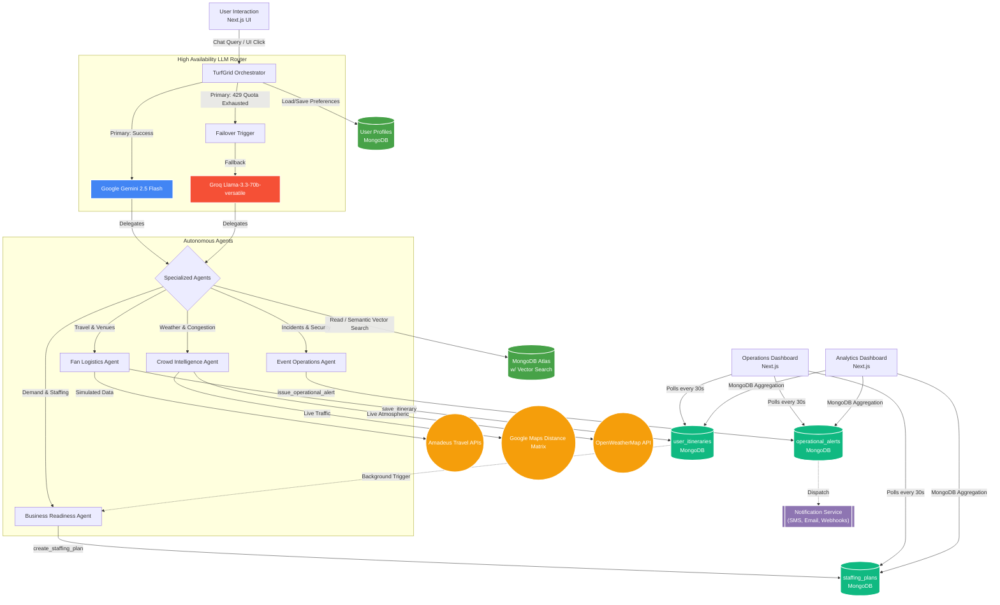

# 🌐 TurfGrid AI

**Smart City Command Center — An autonomous agent swarm that protects cities and businesses from the logistical chaos of global sporting surges.**

> Built for the [Google Cloud Rapid Agent Hackathon](https://devpost.com/) — MongoDB Track

### 🚀 **[Play with the Live Demo Here!](https://turfgrid-ai-frontend-15593284604.europe-west1.run.app/)**


[](LICENSE)
[](https://cloud.google.com/)
[](https://www.mongodb.com/)
[](https://ai.google.dev/)
[](https://groq.com/)

---

## 🎯 What is TurfGrid AI?

TurfGrid AI is an autonomous **Smart City Command Center** that manages the complex logistics of large-scale sporting events. When 80,000 fans descend on a city, local infrastructure breaks — restaurants run out of inventory, roads congest, and security is overwhelmed. Our agents don't just recommend — they **execute actions**, save data to MongoDB, and maintain persistent user memory. Demonstrated with two real events happening simultaneously in 2026:

| Event | Dates | Location | Teams | Venues |
|-------|-------|----------|-------|--------|
| ⚽ **FIFA World Cup 2026** | June 11 – July 19 | USA, Mexico, Canada | 48 | 16 |
| 🏏 **ICC Women's T20 World Cup 2026** | June 12 – July 5 | England | 12 | 7 |

## 🔥 Key Hackathon Features

### 1. MongoDB Vector Search & Semantic Memory
Instead of relying on rigid keyword lookups, TurfGrid AI utilizes **MongoDB `$vectorSearch`**. Venue data is dynamically embedded into 768-dimensional vectors using Google's `gemini-embedding-2`. This allows users to ask natural language questions like *"Find me stadiums near water with large capacities"* and receive mathematically accurate results from Atlas!

### 2. High-Availability LLM Architecture (Gemini ➡️ Groq Failover)
Enterprise agents cannot afford downtime. TurfGrid AI implements a highly resilient architecture. It uses **Google Gemini 2.5 Flash** as its primary orchestrator. However, if the API quota is exhausted (`429 RESOURCE_EXHAUSTED`), the backend intercepts the failure and seamlessly fails over to **Groq's Llama-3.3-70b-versatile** model. Crucially, the fallback system is fully empowered with **OpenAI-compatible tool calling**, meaning even in failover mode, the Llama-3 backup agent can still execute database writes (`save_itinerary`, etc.) and update the dashboard without dropping the user's session. 

### 3. Autonomous State-Altering Actions (v2.0)
Our agents don't just recommend — they **execute**. When a fan approves a travel plan, the agent autonomously calls `save_itinerary()` and writes a confirmed booking to MongoDB. When a business owner asks for staffing advice, the agent calls `create_staffing_plan()` to persist an actionable schedule. Operations agents call `issue_operational_alert()` to flag safety concerns in real-time.

**New MongoDB Collections:**
- `user_itineraries` — Confirmed fan travel plans
- `staffing_plans` — Business match-day staffing schedules
- `operational_alerts` — Live safety and crowd alerts
- `user_profiles` — Persistent user preferences (diet, accessibility, budget)

### 4. Persistent User Memory
The system remembers users across sessions. If a fan says *"I'm vegetarian and need wheelchair access,"* the Orchestrator saves these preferences to MongoDB. The next time they ask for restaurant recommendations, the agent automatically filters for vegetarian, accessible options — without the user repeating themselves.

### 5. Real-Time API Agentic Tool Calling
Our agents are empowered with tools to fetch live data from the outside world:
- **Google Maps Distance Matrix API:** Agents calculate real-time driving durations and traffic delays from user locations to venues.
- **OpenWeatherMap API:** Agents fetch live atmospheric data to predict crowd congestion mitigation strategies.
- **Amadeus Travel API (Simulated):** Agents dynamically extract destinations using a custom NLP intent parser and generate highly realistic flight itineraries and hotel pricing.

### 6. Multi-Agent Transparency & Operations Dashboard
Every agent action is tracked and displayed in the chat UI with a visual orchestration chain (✅ Orchestrator → ✅ Fan Agent → ✅ Tool Called → ✅ MongoDB Updated). The Operations Dashboard polls MongoDB every 30 seconds to show live alerts, saved itineraries, and staffing plans in real-time.

### 7. 🚀 v3.0 Enterprise Architecture Upgrades
We recently transformed the project into a true startup-grade application:
- **Multi-Tenant City Dashboards:** The dashboard now supports filtering by city, allowing parallel management of New York, London, Los Angeles, etc.
- **Real Notifications System:** Critical operational alerts now trigger background asynchronous tasks that dispatch simulated SMS, Email, and Webhook notifications.
- **Historical Analytics (/analytics):** A dedicated analytics portal powered by pure MongoDB `$group` and `$sum` aggregation pipelines to visualize alert frequencies, staffing impact, and fan destinations.
- **Agent-to-Agent Workflows:** True multi-agent collaboration! When the Fan Agent saves an itinerary, the backend automatically spins up the Business Readiness Agent in the background to autonomously generate a staffing plan for the venue, anticipating demand without user input.

---

## 🏗️ Project Architecture

```text
📦 TurfGrid-AI
 ├── 📂 backend/                 # FastAPI Backend Server
 │   ├── 📂 app/                 # Main Application Directory
 │   │   ├── 📂 agents/          # AI Orchestrator & Specialized Agents
 │   │   │   └── 📄 orchestrator.py  # Root agent + 4 sub-agents with action tools
 │   │   ├── 📂 data/            # Seed Data & MongoDB Vector Search logic
 │   │   ├── 📂 tools/           # Agent Tool Modules
 │   │   │   ├── 📄 fan_tools.py       # Travel, venues, flights, hotels, semantic search
 │   │   │   ├── 📄 business_tools.py  # Demand forecasts, checklists
 │   │   │   ├── 📄 crowd_tools.py     # Crowd forecasts, weather, congestion
 │   │   │   ├── 📄 operations_tools.py # Incidents, volunteers, resources
 │   │   │   ├── 📄 action_tools.py    # [NEW] State-altering: save_itinerary, create_staffing_plan, issue_alert
 │   │   │   └── 📄 memory_tools.py    # [NEW] Persistent user memory: save/get preferences
 │   │   ├── 📂 services/         # [v3.0] Background services
 │   │   │   └── 📄 notification_service.py # Event-driven SMS/Email/Webhooks
 │   │   ├── 📄 config.py        # Environment & Configuration settings
 │   │   └── 📄 main.py          # API Routes + v3.0 state endpoints & workflows
 │   ├── 📄 requirements.txt     # Python Dependencies
 │   ├── 📄 run_seed.py          # MongoDB Database Seeding Script
 │   └── 📄 run.py               # Uvicorn Development Server Runner
 │
 ├── 📂 frontend/                # Next.js React Frontend
 │   ├── 📂 src/
 │   │   ├── 📂 app/             # Next.js App Router structure
 │   │   │   ├── 📂 analytics/   # [v3.0] Historical MongoDB Aggregation Dashboard
 │   │   │   ├── 📂 chat/        # Agent Chat + Multi-Agent Transparency Panel
 │   │   │   ├── 📂 dashboard/   # [v3.0] Multi-Tenant Operations Command Center
 │   │   │   ├── 📂 events/      # Venue Explorer & Interactive Modals
 │   │   │   ├── 📄 globals.css  # Core styles, glassmorphism, agent steps animations
 │   │   │   ├── 📄 layout.js    # Root layout, Navbar, and Footer
 │   │   │   └── 📄 page.js      # Smart City Command Center Landing Page
 │   ├── 📄 package.json         # Node.js Dependencies
 │   └── 📄 next.config.mjs      # Next.js Configuration
 │
 ├── 📄 .env                     # Environment Variables (API Keys, DB URL)
 └── 📄 README.md                # Project Documentation
```

---

## 🔄 Project Workflow



## 🚀 Quick Start

### Prerequisites
- Python 3.11+
- Node.js 22.13+
- MongoDB Atlas account
- Google Gemini API key (Primary)
- Groq API key (Failover)
- Google Maps & OpenWeatherMap keys (Optional for Live Data)

### 1. Clone & Configure

```bash
git clone https://github.com/ayus1234/turfgrid-ai.git
cd turfgrid-ai
# Update .env with your specific API Keys!
```

### 2. Backend Setup

```bash
cd backend
python -m venv venv
venv\Scripts\activate        # Windows
# source venv/bin/activate   # Mac/Linux
pip install -r requirements.txt
python run.py
```

### 3. Frontend Setup

```bash
cd frontend
npm install
npm run dev
```

Open `http://localhost:3000` to interact with the platform!

---

## 🤖 Agent Capabilities & Example Interactions

> **"I want to fly from London to New York for the World Cup. Book a hotel and tell me the traffic to MetLife Stadium."**
> → The system parses the intent, detects the 'JFK' and 'NYC' routing, simulates flight/hotel prices, checks the live Google Maps API for traffic, and returns a fully formatted response.

> **"I own a restaurant near Lord's. India vs England tomorrow — how should I prepare?"**
> → Business Agent predicts 2.5x demand, recommends adding 4 staff, increasing food stock 150% and beverages 225%.

> **"Find me stadiums near the water."**
> → Hits the MongoDB `$vectorSearch` pipeline, comparing the user's sentence embedding against the embedded dataset, correctly returning venues like SoFi Stadium.

## 📄 License
MIT License — see [LICENSE](LICENSE)

## 🙏 Acknowledgments
- [Google Cloud](https://cloud.google.com/) — Gemini AI & Agent Development Kit
- [MongoDB](https://www.mongodb.com/) — Atlas & Vector Search
- [Groq](https://groq.com/) — High-speed Llama 3 inference
- FIFA & ICC — for inspiring the challenge scenarios
